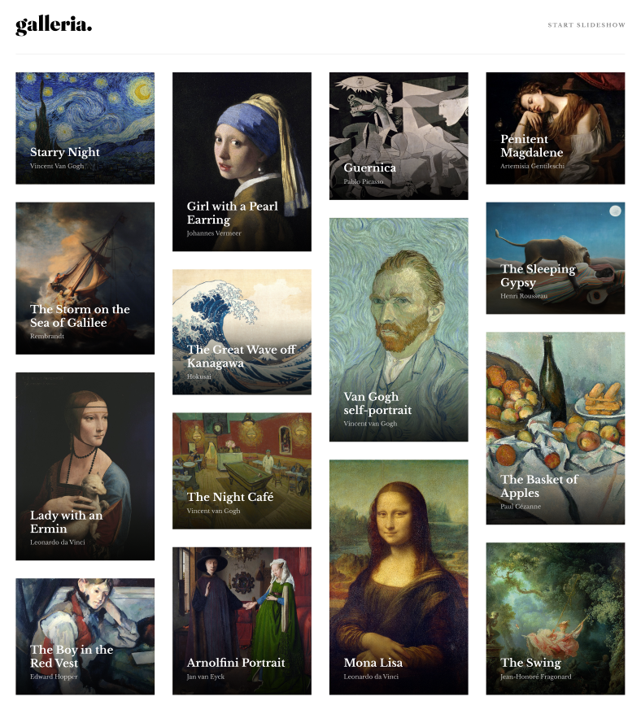

<h1 align="center">GALLERIA SLIDESHOW SITE</h1>

<div align="center">
 <a href="https://ivandefender.github.io/Galleria/index.html">View Project |</a>
 <a href="https://github.com/Ivandefender/Galleria">View Code</a>
</div>

<p align="center">


</p>

# Start HTML

## **Є два файли HTML-** index.html та art_page.html:

# Start index.html

Основна сторінка з набором картин, з якими можна взаємодіяти



## Start Header

### **Будова:**

1. Логотип сайта
2. Кнопка для початку слайд-шоу

## End Header

## Start Main

### **Будова:**

Набір 4 колонок, які складаються із секцій з однаковою будовою, але різним вмістом

Секція:

- Зображення картини її назва та автор

## End Main

# End index.html

# Start art_page.html

")

Шаблонна сторінка на яку підвантажуються дані про певну картину

## Start Header

### **Будова:**

1. Логотип сайта
2. Кнопка для припинення слайд-шоу

## End Header

## Start Main

### **Будова:**

Сторінка на якій відображується вміст сторінки про `конкретну картину`

Секція:

- Дві колонки (ліва - зображення картини та автора і назва, справа - детальна інформація про неї)

## End Main

## Start Footer

Перемикач сторінок із картинами `(слайд-шоу плеєр)` та полоса `"прогресу"`

## End Footer

# End art_page.html

# End HTML

# Start CSS

## **Style.css** - основні стилі для сторінок

### **Специфічні селектори класів:**

Змінні з кольорами для кращого орієнтування

```css
:root {
  --white: #fff;
  --black: #000;
  --dark-grey: #7d7d7d;
  --grey: #e5e5e5;
  --light-grey: #f3f3f3;
}
```

**Приклад використання змінної з кольором:**

```css
.art__name {
  color: var(--white);
}
```

Будь-який клас, який містить в собі частину `__container`

```css
[class*="__container"] {
  margin: 0 auto;
  max-width: 1360px;
}
```

# End CSS

# Start JS

### **Є два файли -** .js та .json:

1. **Data.json** - файл з даними які підвантажуються на HTML-сторінку. `Кожні дані в свою секцію`.
2. **Art_page.js** - основний файл програми.

### **Функції:**

```javascript
addContent(); // загальна функція, яка приводить у роботу інші сторінки для підвантаження на вмісту

loadData(); // отримуємо дані з data.json

getCurrentArtData(); // отримання конкретних даних про картину через посилання

insertArtData(); // механізм підвантаження даних (створення тегів, додавання інформації в теги, зміна стилів)
```

### `Уточнення, щодо змінних`

1. length - довжина масиву картин (їх кількість)
2. currentArtIndex - конкретний індекс картини, який отримується із строки адреси поточної сторінки 
3. artsName - масив назв картин, для формування строки адреси, щоб змінити вміст сторінки
4. progressBar - отримання доступу до div з класом progress__bar
5. barLength - отримання поточної ширини браузера 
6. line - обрахунок заповненої частини лінії progress bar

#### **Механізм роботи progress bar**

```javascript
const progressBar = document.querySelector(".progress__bar");
const barLength = Math.floor(progressBar.getBoundingClientRect().width);
const line = (barLength / length) * (Number(currentArtIndex) + 1);
progressBar.style.width = `${line}px`;
```

```html
<div class="progress">
  <div class="progress__bar"></div>
</div>
```

#### **Механізм роботи плеєра слайд-шоу**

```javascript
const prevBtn = document.querySelector(".prev");
const nextBtn = document.querySelector(".next");

nextBtn.addEventListener("click", () => {
  if (currentArtIndex == length - 1) {
    // currentArtIndex = 0;
    return;
  }
  currentArtIndex++;

  window.location.href = `./art_page.html?art=${artsName[currentArtIndex]}&&index=${currentArtIndex}`;
});

prevBtn.addEventListener("click", () => {
  if (currentArtIndex == 0) {
    // currentArtIndex = length;
    return;
  }
  currentArtIndex--;

  window.location.href = `./art_page.html?art=${artsName[currentArtIndex]}&&index=${currentArtIndex}`;
});
```

```html
<div class="footer__inner-btns">
  <button class="prev slide__btn"></button>
  <button class="next slide__btn"></button>
</div>
```

# End JS

### Дизайн був взятий з [FrontendMentor.io](https://www.frontendmentor.io/challenges/galleria-slideshow-site-tEA4pwsa6);

### Розробив: [Ivan Krysak (github: Ivandefender)](https://github.com/Ivandefender);
